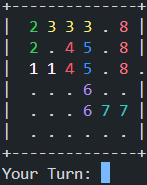

# Rush Hour in TypeScript

## Description
Ever wanted to play the classic board game Rush Hour in your console? No? Well, now you can anyways!   
Push cars around to get your own car (number 1) to the exit of the parking lot.

## Easy setup and start
```bash
npm install
npx ts-node index.ts
```

## Controls
1. When asked choose a level by entering a single number.
2. Cars are defined by their number. When asked for your next turn enter the number of the car you want to move followed by the direction in which you want to move the car.  
Possible directions are `w` (up), `a` (left), `s` (down) and `d` (right). You can repeat the direction to move more than one step at once. Some examples:
    ```
    1d   -> move car 1 to the right for one step
    12w  -> move car 12 up for 1 step
    5sss -> move car 5 down for three steps
    ```
3. To end the game early enter `q` when asked for your next turn.